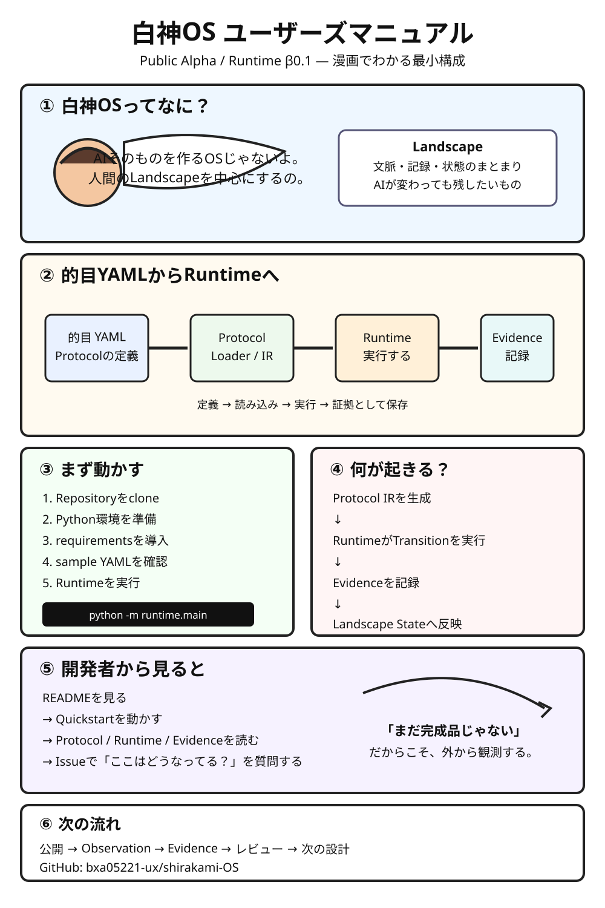

# 白神OS ユーザーズマニュアル（漫画版）

白神OS Public Alpha / Runtime β0.1 の最小構成と使い方を、漫画形式で説明します。

## このマニュアルで分かること

- 白神OSが何を中心にしているか
- 的目YAMLからProtocol Loader / Protocol IRを経てRuntimeへ入る流れ
- EvidenceとLandscape Stateがどこに現れるか
- Quickstartで何を試すか
- Public Alphaで第三者がどのように観測・レビューできるか

## 注意

これは現在のβ0.1実装を説明するためのユーザー向け資料です。完全なProtocol仕様や、すべての的目YAMLを実行できることを意味しません。

詳細な仕様は `spec/` と `docs/` の資料を参照してください。
